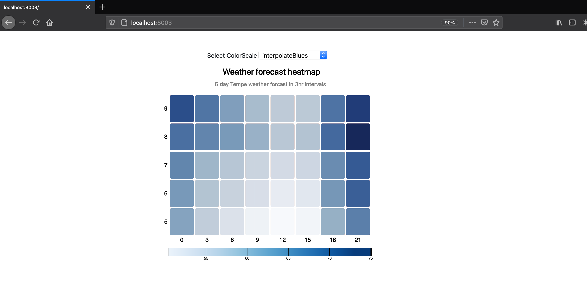
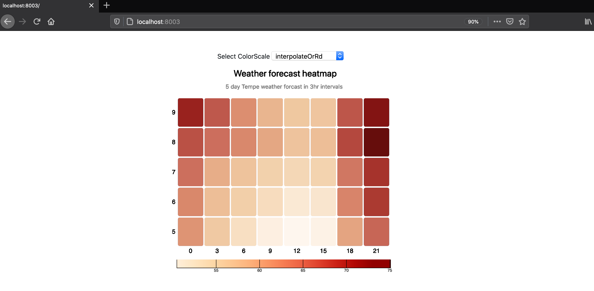
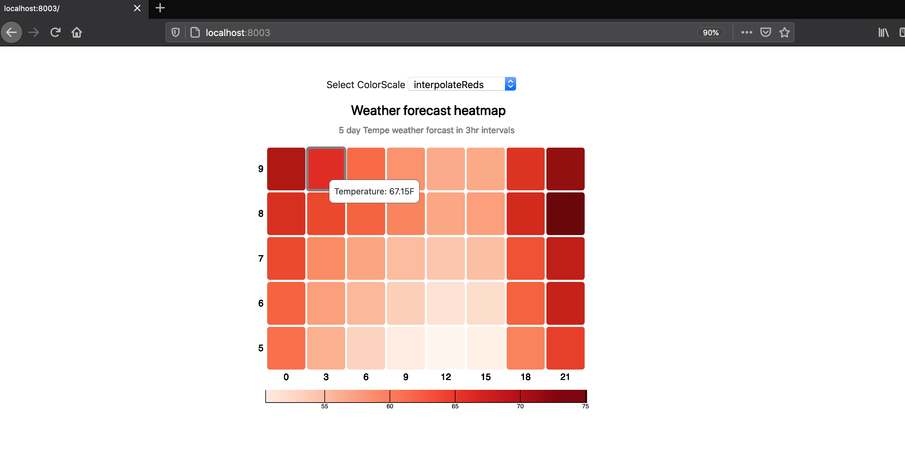
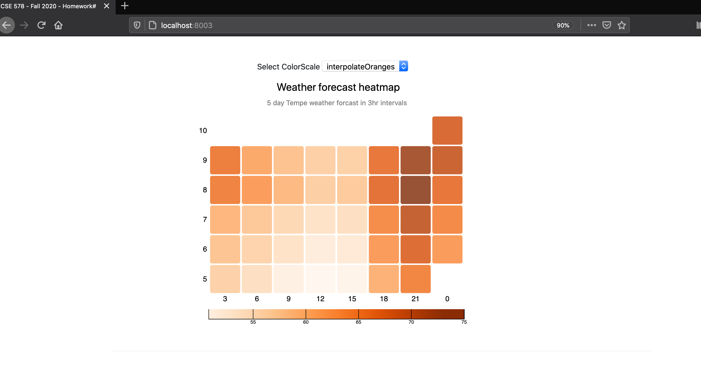

# Repository Description

This repository has been created to serve as an assignment for the course CSE 578 - Data Visualization at ASU

# D3 Heatmap and Interactivity

The purpose of this homework is to create heatmap visualization in D3 by consuming realtime weather data and add some interactions. By the end of this assignment you should learn how to:

* Connect realtime api data to your chart
* Use mouse events
* Using Colorscales
* Update color scheme via html elements
* Add tooltips to charts
* Create a legend
* Add chart titles and style them

## Data Description

The data source for this assignment is a real time API (http://api.openweathermap.org/) which provides weather forcast data. Using this api requires an api_key which can be ontained by signing up in the above link. Alternately, any other weather api can be consumed but the results need to contain an hourly forecast for atleast 5 days

Usage:

*  `http://api.openweathermap.org/data/2.5/forecast?zip=85281,us&APPID={your_api_id_here}&units=imperial` Querying this link will provide JSON data of the weather forecast for zipcode 85281(Tempe). An example response is pasted below

```
{
  "cod": "200",
  "message": 0,
  "cnt": 40,
  "list": [
    {
      "dt": 1607126400,
      "main": {
        "temp": 62.22,
        "feels_like": 55.6,
        "temp_min": 59.47,
        "temp_max": 62.22,
        "pressure": 1021,
        "sea_level": 1021,
        "grnd_level": 978,
        "humidity": 18,
        "temp_kf": 1.53
      },
      "weather": [
        {
          "id": 800,
          "main": "Clear",
          "description": "clear sky",
          "icon": "01d"
        }
      ],
      "clouds": {
        "all": 1
      },
      "wind": {
        "speed": 2.59,
        "deg": 264
      },
      "visibility": 10000,
      "pop": 0,
      "sys": {
        "pod": "d"
      },
      "dt_txt": "2020-12-05 00:00:00"
    }
  ]
}
```
* Note that this endpoint provides 3hr forecast for 5 days
* Format this data and filter out the timestamp and temperature value for that timestamp
* Extract Day and hour information from the timestamp
* You may filter any additional information that is of interest (optional)


> 🔍 **Hint:** For Date formatting in Javascript follow the link https://www.w3schools.com/js/js_date_methods.asp

## To start the assignment


* Clone this code template to your local machine.
* Start a local server and open the **index.html** page.
* Modify the given code according to the instructions below to achieve an interface like the following screenshot.
* Commit and push the code back to this repository to submit it. The finished chart in index.html should look like this:




## Step 0: Starting code

When you first download and see the code, you should see the div with id "my_dataviz" in index.html. Use this div to attach your svg in which heatmap will be plotted. In the index.js comments have been placed as placeholders for the required functionality, use the comments as directions

## Step 1: Format Data as needed to generate Heatmap

Format the data in such a way that you get an array of objects, where each object looks like this

```

data =[
  {
    "day": 5,
    "hour": 3,
    "value": 62.65
  },
  {
    "day": 5,
    "hour": 6,
    "value": 64.52
  }, ...
]

```

You are free to format it any other way, above is an example

## Step 2:Plot HeatMap and Add X,Y axes

1. Add X axis showing ticks as day numbers and Y axis showing ticks as hour start numbers as shown in the image

2. Plot your heatmap after formatting data and use a colorscale to fill the colors. The rects used for the heatmap should have rounded corners and the gaps between the rects should not have any color as shown in picture

> 🔍 **Hint:** Heatmap is nothing but a group of rectanges. In your heatmap plot one rectange for each object in the data.


## Step 3: Make the color scale interactive

1. Make it so that when the color scale dropdown (id=`color-scale-select`) is changed, the heatmap's color scale updates to the selection.

2. Then, pick two additional scales (see the D3 [scale-chromatic page](https://github.com/d3/d3-scale-chromatic) for examples) and add them as options to color the map.

3.  The scale's domain should go from min temperature value to the max temperate value obtained from the API


 

## Step 4: Add a legend

1. Add a color scale legend at approximately the same place (and with the same stylings) as shown in the screenshot above. This example may be used as a reference: [link](https://observablehq.com/@tmcw/d3-scalesequential-continuous-color-legend-example). In the screenshot, my scale is same width as chart and 20 height. The scale's domain should go from min temperature value to the max temperate value obtained from the API.

2. When the colorScale is updated from the dropdown, legend should change accordingly

## Step 5: Add a hover tooltip to the heat-map

When the user hovers or moves the mouse over a rectangle on the map, higlight the rectange with a grey-colored border and show a hover tooltip to the right of the mouse. The borders should go back to the standard styling when the heatmap is no being longer hovered upon

The tooltip should show the temperature value of the rectangle hovered on as shown in below picture. You'll want to use mouse events (`mouseover`, `mousemove`, and `mouseout`) to control the functionality. The tooltip should follow the mouse as it moves over the heatmap

> 🔍 **Hint:** For the tooltip, one option is defining a div that's hidden unlesss you are hovering on a country; then you populate the div with the appropriate information. See this page for an example: [Show data on mouse-over with d3.js](https://medium.com/@kj_schmidt/show-data-on-mouse-over-with-d3-js-3bf598ff8fc2).



## Step 4: Add a chart title and Subtitle

Add a chart title and subtitle by attaching a svg text element and style to so that it aligns to the centre of the chart

## Note

As the data is fetched realtime, the heatmap may not have all the rectangles as shown in the screenshot based on the time during which the chart is viewed. Api return data until the current hour. It is okay if the heatmap is not a complete Grid as shown below



## Completion
Once you've finished all of the steps and have the charts looking like the attached picture and with the interactins, commit and push your code by the deadline.
